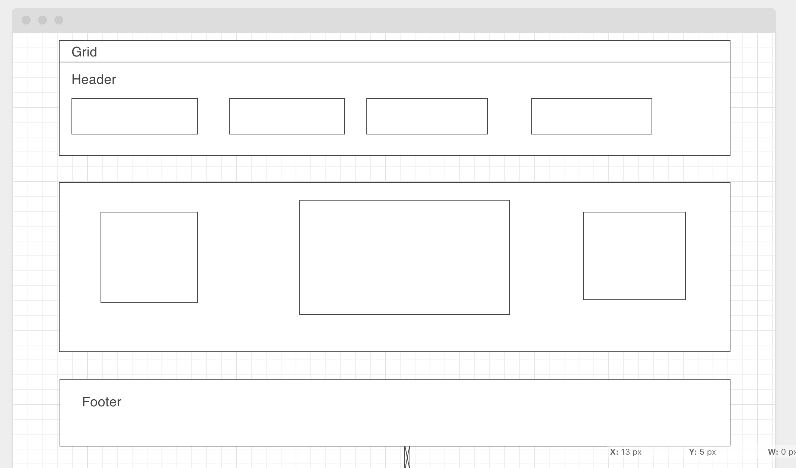

# TIC-TAC-TOE-GAME
Wireframe: 
Project Preview:
This is a game of Tic-Tac-Toe.

Technology used:

Terminal: used for interacting with the computer, navigating the filesystem. 

Source Control: used for interaction, management and upload changes on code to Git repository.

wireframe.cc: used for building the wireframe.

Visual Studio Code: used for coding with Html, CSS, and JavaScript.

Google Chrome Web Browser: used for launching the website.

Google Chrome Developer Tools: used to debug and solve problems in the code.

Installation:
->Web Browser
->Internet Connectivity
->JavaScript
->Command Line
->Source Control
->Visual Studio 

Approach:

For an empty array i used DOM-events to gather information from players and i used for-loop and if-else conditions to check win conditions, rotate turns and validate the winner among two players. 

Main features:

User can customize their tokens.(symbols, letters, names)

Visual Display of Winner.

Used ripple effect for buttons,prompts, moving images etc.

Used grid,flexbox, settimeout function etc.

Visual Effects to make it attractive and fun.

User Stories:

 As a user, I should be able to start a new tic tac toe game.

As a user ,I(players) should be able to pick the names, symbols, numbers etc to play the game.

As a user, I should be able to click on a square to add X first and then O, and so on.

As a user, I should be shown a message which player win, lose, or draw(tie game).

As a user, I should not be able to click the same square twice.

As a user, I should not be able to continue playing once I win, lose, or tie.

As a user, I should be able to play the game again by refreshing the page.

Future Plans:

Enhancing the game options to allow players to play series of games and storing the data to track results.

